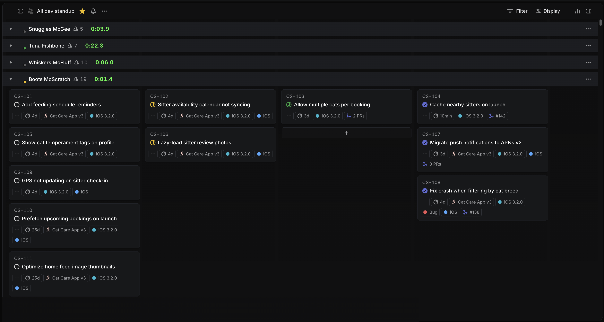

# Linear Standup

A Chrome extension that turns a Linear view into a standup timer. Shuffles team members into a random order, tracks time per person, and lets you advance through the list with spacebar.

## Features

- **Random order** — shuffles participants each standup
- **Per-person timer** — live tenth-of-a-second timer for each person
- **Spacebar navigation** — press space to advance to the next person
- **Include/exclude lists** — configure which users to include via the popup
- **Persistent settings** — standup URL and exclusions saved across sessions
- **Auto-discovery** — learns team members from the first run

## Install

1. Clone this repo
2. Open `chrome://extensions` and enable Developer Mode
3. Click "Load unpacked" and select this directory

## Usage

1. Click the extension icon to open the popup
2. Paste your Linear standup view URL
3. Optionally exclude team members using the chip controls
4. Click **Start Standup**
5. Press **Space** to advance through each person
